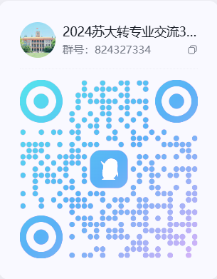
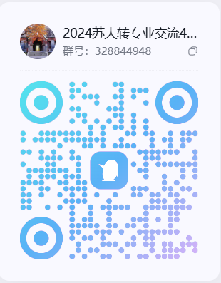

# 苏州大学 转专业通用指南

本文网站<https://suda-major-change.github.io/sudazzy/>

本文主要是为苏州大学正在准备或是打算准备转专业的同学编写的。

近年来由于教育改革等各种原因，转专业正逐渐变得愈发困难，但相对之下同学们转专业的盲目性却在不断增加。在近几个月内，笔者看到了很多同学在重复询问一些很简单的相关问题，也有很多同学对转专业一无所知却无比焦急，这让我联想到了之前正准备转专业的我同样充满迷茫。为此，笔者写下这篇文章，旨在整合与转专业有关或是关系不太密切的各种信息，并以较为系统与直观的方式呈现出来。

阅读本文不要求你事先对转专业有任何了解。笔者将从头开始介绍与转专业相关的一切。同时，也不要求你对大学生活有关的知识有任何了解，一切笔者认为必要且部分读者可能并不清楚的前置信息都会在文中说明，一部分会归入杂项。因此，本文其实也可以当作一份另类的大学生活指南。

需要注意的是，本文不会介绍苏州大学各学院具体的转专业政策，只介绍通用信息。**但会给出一些已经转专业成功的各位热心学长学姐们编写的各学院的转专业相关经验分享。**

对于希望转入其他学院的读者，请自行联系转专业成功的有经验者进行咨询。

在大多数情况下，网站可以裸连，否则可能你需要进行一些其他操作来确保连接

## 注意（非常重要）

**转专业政策可能每年都会变！！！一定要注意本文时效性！！！**

**本文第二版内容更新于2026年4月，并且保留了大部分第一版的内容和经验（3年前），所有内容不保证完全具体、真实与时效性，仅限参考！！！甚至有些内容放在如今的转专业政策上，已经错误！！！本文仅限参考！！！**

## 联系方式

**第一版**

笔者是苏州大学 2020 级的一名普通学生，于大一下半学期即 2021 年上半年参加转专业考试成功转入苏州大学计算机科学与技术学院的软件工程专业。

第一版挂载在gitbook和知乎上

如发现文章存在问题，或是有和转专业有关的任何问题以及学业相关问题，都可以与笔者通过邮箱[gaoge011022@163.com](mailto:gaoge011022@163.com)进行沟通，也可在邮件中索要 QQ 等其他联系方式方便交流。

**第二版**

笔者是苏州大学 2022 级的一名普通学生，于大一下半学期即 2023年上半年参加转专业考试成功转入苏州大学电子信息学院的通信工程专业。

第二版采用mkdocs构建 挂载在GitHub pages上

如发现文章存在问题，或是有和转专业有关的任何问题以及学业相关问题，都可以与笔者通过邮箱[2889087473@qq.com](mailto:2889087473@qq.com)进行沟通。

**热心前辈（欢迎联系解答疑问）**

1.[596724086@qq.com](mailto:596724086@qq.com)(20外院转商院)

2.

## 如何参与本项目

本项目为开源项目，欢迎各位同学进行修改与添加内容。

### 懒人版（推荐）

如果你对 Github 一无所知，也不怎么精通计算机技术。可以直接将修改建议或访谈集发到邮箱[gaoge011022@163.com](mailto:gaoge011022@163.com)或者[2889087473@qq.com](mailto:2889087473@qq.com)

我们会定期查看邮箱，并将相关内容手动放到这篇指南里。

对于访谈集，如果你希望署名的话，请在邮件中附上你希望展示的作者名。

### 自己动手版

如果你对 Github 的使用有一定了解，那么建议你自己动手修改，这样也会比较自由。

下面是修改流程：

在 Github 上将项目fork到个人账户，然后将项目 clone 至本地，对.md 文件作出修改。

另外，请遵照一定的文件命名格式

完成修改后，请 commit 修改并在本地 push 至 Github，然后发起 Pull Request

## 尾言

1.如果你看了这篇内容后对转专业有启示并且转专业成功，欢迎热心的你前来写文章，分享自己的经验故事

2.祝愿各位同学转专业成功，学业有成！

## 转专业交流大群

